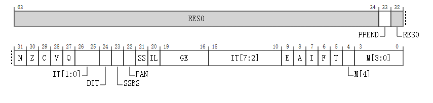

# SPSR_EL2(保存程序状态寄存器)

当发生异常进入 EL2 执行级别时，保存进程的状态。

## 配置 

在 AArch64 架构中，系统寄存器 SPSR_EL2 的比特位 [31:0] 在架构上被映射到 AArch32 架构中的系统寄存器 SPSR_hyp 的比特位 [31:0]。

如果当前的安全状态下没有启用 EL2，则该寄存器无效。

## 属性

SPSR_EL2 是一个 64 位的寄存器。

## 字段描述

当支持 AArch32 并且异常从 AArch32 状态发生时：

### Bits [63:34]

保留, RES0

### PPEND, bit [33]

当 FEAT_SEBEP 被实现时：

PMU Profiling 异常待处理位。当发生异常进入 EL2 级别时设置为 PSTATE.PPEND 的值，并在 EL2 中执行异常返回操作时有条件地复制回 PSTATE.PPEND。

重置行为：

- 在热重置 (Warm reset) 时，此字段重置为架构上未知的值。

否则：

- 预留，RES0。

### Bits [32]

保留, RES0

### N, bit [31]

当发生异常进入 EL2 级别时：

负条件标志。 设置为 PSTATE.N 的值，并在 EL2 中执行异常返回操作时复制回 PSTATE.N。

重置行为：

- 在热重置 (Warm reset) 时，此字段重置为架构上未知的值。

### Z, bit [30]

当发生异常进入 EL2 级别时：

- 零条件标志。设置为 PSTATE.Z 的值，并在 EL2 中执行异常返回操作时复制回 PSTATE.Z。

重置行为：

- 在热重置 (Warm reset) 时，此字段重置为架构上未知的值。

### C, bit [29]

当发生异常进入 EL2 级别时：

- 进位条件标志。设置为 PSTATE.C 的值，并在 EL2 中执行异常返回操作时复制回 PSTATE.C。

重置行为：

- 在热重置 (Warm reset) 时，此字段重置为架构上未知的值。

### V, bit [28]

当发生异常进入 EL2 级别时：

- 溢出条件标志。 设置为 PSTATE.V 的值，并在 EL2 中执行异常返回操作时复制回 PSTATE.V。

重置行为：

- 在热重置 (Warm reset) 时，此字段重置为架构上未知的值。

### Q, bit [27]

当发生异常进入 EL2 级别时：

- 溢出或饱和标志。设置为 PSTATE.Q 的值，并在 EL2 中执行异常返回操作时复制回 PSTATE.Q。

重置行为：

- 在热重置 (Warm reset) 时，此字段重置为架构上未知的值。

### IT, bit [15:10, 26:25]

**当发生异常进入 EL2 级别时：**

- **If-Then。** 设置为 PSTATE.IT 的值，并在 EL2 中执行异常返回操作时复制回 PSTATE.IT。

- **要求：** SPSR_EL2.IT 必须包含对于返回的指令有效的值。

**IT 字段分为两部分：**

- IT[1:0] 对应 SPSR_EL2[26:25]。
- IT[7:2] 对应 SPSR_EL2[15:10]。

**重置行为：**

- 在热重置 (Warm reset) 时，此字段重置为架构上未知的值。

### DIT, bit [24]

**当 FEAT_DIT 被实现时：**

- **数据独立定时。** 当发生异常进入 EL2 级别时设置为 PSTATE.DIT 的值，并在 EL2 中执行异常返回操作时复制回 PSTATE.DIT。

**重置行为：**

- 在热重置 (Warm reset) 时，此字段重置为架构上未知的值。

**否则**：

- 预留，RES0（即应始终读取为 0）。

### SSBS, bit [23]

**当 FEAT_SSBS 被实现时：**

- **投机性存储旁路。** 当发生异常进入 EL2 级别时设置为 PSTATE.SSBS 的值，并在 EL2 中执行异常返回操作时复制回 PSTATE.SSBS。

**重置行为：**

- 在热重置 (Warm reset) 时，此字段重置为架构上未知的值。

**否则**：

- 预留，RES0（即应始终读取为 0）。

### PAN, bit [22]

**当 FEAT_PAN 被实现时：**

- **特权访问永不。** 当发生异常进入 EL2 级别时设置为 PSTATE.PAN 的值，并在 EL2 中执行异常返回操作时复制回 PSTATE.PAN。

**重置行为：**

- 在热重置 (Warm reset) 时，此字段重置为架构上未知的值。

**否则**：

- 预留，RES0（即应始终读取为 0）。

### SS, bit [21]

**软件步进。** 当发生异常进入 EL2 级别时设置为 PSTATE.SS 的值，并在 EL2 中执行异常返回操作时有条件地复制回 PSTATE.SS。

**重置行为：**

- 在热重置 (Warm reset) 时，此字段重置为架构上未知的值。

### IL, bit [20]

**非法执行状态。** 当发生异常进入 EL2 级别时设置为 PSTATE.IL 的值，并在 EL2 中执行异常返回操作时复制回 PSTATE.IL。

**重置行为：**

- 在热重置 (Warm reset) 时，此字段重置为架构上未知的值。

### GE, bit [19:16]

**大于等于标志。** 当发生异常进入 EL2 级别时设置为 PSTATE.GE 的值，并在 EL2 中执行异常返回操作时复制回 PSTATE.GE。

**重置行为：**

- 在热重置 (Warm reset) 时，此字段重置为架构上未知的值。

### E, bit [9]

**字节序。** 当发生异常进入 EL2 级别时设置为 PSTATE.E 的值，并在 EL2 中执行异常返回操作时复制回 PSTATE.E。

- 如果实现不支持大端模式操作，则 SPSR_EL2.E 为 RES0。
- 如果实现不支持小端模式操作，则 SPSR_EL2.E 为 RES1。
- 在 EL2 中执行异常返回操作时，如果返回的异常级别不支持大端模式操作，则 SPSR_EL2.E 为 RES0；如果不支持小端模式操作，则 SPSR_EL2.E 为 RES1。

**重置行为：**

- 在热重置 (Warm reset) 时，此字段重置为架构上未知的值。

### A, bit [8]

**SError 异常屏蔽。** 当发生异常进入 EL2 级别时设置为 PSTATE.A 的值，并在 EL2 中执行异常返回操作时复制回 PSTATE.A。

**重置行为：**

- 在热重置 (Warm reset) 时，此字段重置为架构上未知的值。

### I, bit [7]

**IRQ 中断屏蔽。** 当发生异常进入 EL2 级别时设置为 PSTATE.I 的值，并在 EL2 中执行异常返回操作时复制回 PSTATE.I。

**重置行为：**

- 在热重置 (Warm reset) 时，此字段重置为架构上未知的值。

### F, bit [6]

**FIQ 中断屏蔽。** 当发生异常进入 EL2 级别时设置为 PSTATE.F 的值，并在 EL2 中执行异常返回操作时复制回 PSTATE.F。

**重置行为：**

- 在热重置 (Warm reset) 时，此字段重置为架构上未知的值。

### T, bit [5]

**T32 指令集状态。** 当发生异常进入 EL2 级别时设置为 PSTATE.T 的值，并在 EL2 中执行异常返回操作时复制回 PSTATE.T。

**重置行为：**

- 在热重置 (Warm reset) 时，此字段重置为架构上未知的值。

### M[4], bit [4]

**执行状态。** 当从 AArch32 状态发生异常进入 EL2 级别时设置为 0b1，即 PSTATE.nRW 的值，并在 EL2 中执行异常返回操作时复制回 PSTATE.nRW。

| M[4] | 含义               |
| ---- | ------------------ |
| 0b1  | AArch32 执行状态。 |

**重置行为：**

- 在热重置 (Warm reset) 时，此字段重置为架构上未知的值。

### M[3:0], bit [3:0]

**Arch32 模式。** 当发生异常进入 EL2 级别时设置为 PSTATE.M[3:0] 的值，并在 EL2 中执行异常返回操作时复制回 PSTATE.M[3:0]。

| M[3:0]  | 含义     |
| ------- | -------- |
| 0b00000 | 用户态   |
| 0b00001 | FIQ 态   |
| 0b0010  | IRQ 态   |
| 0b0011  | 监管者态 |
| 0b0111  | 中止态   |
| 0b1010  | Hyp 态   |
| 0b1011  | 未定义态 |
| 0b1111  | 系统态   |

**其他值保留。** 如果 SPSR_EL2.M[3:0] 有预留值或者表示未实现的异常级别的值，在 EL2 中执行异常返回操作是非法返回事件，如 "AArch64 状态下的非法返回事件" 描述的那样。

**重置行为：**

- 在热重置 (Warm reset) 时，此字段重置为架构上未知的值。

## 当 AArch64 状态出现异常时:

[查阅文档](https://developer.arm.com/documentation/ddi0601/2024-06/AArch64-Registers/SPSR-EL2--Saved-Program-Status-Register--EL2-?lang=en)