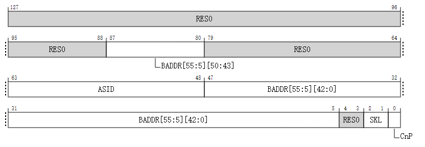

# TTBR0_EL2, 翻译表基地址寄存器 0 (EL2)

- 当 `HCR_EL2.E2H` 的有效值不是 1 时，保存 EL2 翻译模式下地址转换第一阶段初始查找的翻译表基地址，以及该翻译模式下的其他信息。
- 当 `HCR_EL2.E2H` 的有效值为 1 时，保存 EL2&0 翻译模式下地址转换第一阶段对较低 VA 范围初始查找的翻译表基地址，以及该翻译模式下的其他信息。

## 配置

- 在 AArch64 架构中，系统寄存器 TTBR0_EL2 的位 [47:1] 在架构上映射到了 AArch32 架构中的系统寄存器 HTTBR 的位 [47:1]。
- 如果 EL2 没有被实现，那么此寄存器从 EL3 视角来看是保留为零（RES0）的。
- 如果在当前安全状态下 EL2 没有被启用，那么这个寄存器将不会产生任何效果。

## 属性

- TTBR0_EL2 是一个 128 位的寄存器，当实现了 `FEAT_D128` 并且 `TCR2_EL2.D128` 为 1 以及 `HCR_EL2.E2H` 的有效值为 1 时；
- 或者是一个 64 位的寄存器，当没有实现 `FEAT_D128` 或者 `TCR2_EL2.D128` 为 0 时。

当实现了 `FEAT_D128`、`TCR2_EL2.D128` 为 1 以及 `HCR_EL2.E2H` 的有效值为 1 时：

- TTBR0_EL2 是一个 128 位的寄存器。
- 当作为 64 位寄存器访问时，访问会读取和写入位 [63:0]，而位 [127:64] 不会被修改。

## 字段描述

**实施FEAT_D128时，TCR2_EL2。D128 == 1 和 HCR_EL2 的有效值。E2H 为 1：**



### Bits [127:88]

保留, RES0

### BADDR[55:5], bits [87:80, 47:5]

翻译表基地址 (Translation Table Base Address):

- 位 A[55:x] 的第一阶段翻译表基地址位存储在寄存器位 [87:80, 47:x] 中。
- 位 A[(x-1):0] 的第一阶段翻译表基地址为 0。
- 地址位 x 是为了将翻译表对齐到表大小所需的最小地址位。x 根据 LOG2(StartTableSize) 计算得出，具体描述见 VMSAv9-128。x 的最小允许值为 5。

BADDR[55:5] 字段拆分如下：

- `BADDR[55:5][50:43]` 对应 `TTBR0_EL2[87:80]`。
- `BADDR[55:5][42:0]` 对应 `TTBR0_EL2[47:5]`。

重置行为

- 在温重置 (Warm reset) 时，此字段重置为架构上未知的值。

### Bits [79:64]

- 保留位，RES0)。


### ASID, bits [63:48]
当实现了 `FEAT_VHE` 特性：

- 当 `HCR_EL2.E2H` 的有效值为 1 时，它保存了一个与翻译表基地址关联的 ASID（地址空间标识符）。`TCR_EL2.A1` 字段选择使用 `TTBR0_EL2.ASID` 或 `TTBR1_EL2.ASID`。

- 如果实现仅支持 8 位 ASID，则此字段的高 8 位是保留为 0 (RES0) 的。

**重置行为**

- 在温重置 (Warm reset) 时，此字段重置为架构上未知的值。

**否则**

- 保留，RES0。

### Bits [4:3]

保留, RES0.


### SKL, bit [2:1]
与使用 TTBR0_EL2 进行的翻译表遍历相关的跳过级别。

这决定了从使用 TTBR0_EL2 的第一阶段 EL2&0 翻译表遍历的常规起始级别跳过多少个级别。

| SKL  | 意义                          |
| ---- | ----------------------------- |
| 0b00 | 从常规起始级别跳过 0 个级别。 |
| 0b01 | 从常规起始级别跳过 1 个级别。 |
| 0b10 | 从常规起始级别跳过 2 个级别。 |
| 0b11 | 从常规起始级别跳过 3 个级别。 |

**重置行为**

- 在温重置 (Warm reset) 时，此字段重置为架构上未知的值。


### CnP, bit [0]
当实现了 `FEAT_TTCNP` 特性：

- Common not Private. 这一位指示由 TTBR0_EL2 指向的每一项条目是否属于一个共享集合，该集合可被 Inner Shareable 域内的每个 PE（Processing Element）使用，前提是 TTBR0_EL2 的 CnP 位为 1。

| CnP  | 意义                                                         |
| ---- | ------------------------------------------------------------ |
| 0b0  | 由 TTBR0_EL2 指向的当前翻译模式及其适用的 ASID 的翻译表条目允许与 Inner Shareable 域内其他 PE 的 TTBR0_EL2 的相应条目不同。这不受以下因素的影响：<br>- 其他 PE 上的 TTBR0_EL2 的 CnP 值。<br>- 当前翻译模式是 EL2&0 模式时，当前 ASID 的值。 |
| 0b1  | 由 TTBR0_EL2 指向的翻译表条目与 Inner Shareable 域内所有其他 PE 的 TTBR0_EL2 的翻译表条目相同，这些 PE 的 TTBR0_EL2 的 CnP 位为 1，并且满足以下所有条件：<br>- 翻译表条目是由 TTBR0_EL2 指向的。<br>- 翻译表与相同的翻译模式相关联。<br>- 如果翻译模式是 EL2&0 模式，那么 ASID 与当前 ASID 相同。 |

这一位可以被缓存在 TLB（Translation Lookaside Buffer）中。

- 如果 Inner Shareable 域内的多个 PE 的 TTBR0_EL2 的 CnP 位为 1，而这些 TTBR0_EL2 指向的翻译表条目在其他条件适用时并不相同，那么翻译的结果是受约束的不可预测的（CONSTRAINED UNPREDICTABLE），请参阅 "由于控制或数据值的缓存导致的 CONSTRAINED UNPREDICTABLE 行为"。

**重置行为**

- 在温重置 (Warm reset) 时，此字段重置为架构上未知的值。

**否则：**

保留，RES0


**实施FEAT_D128时，TCR2_EL2。D128 == 1 和 HCR_EL2 的有效值。E2H 为 1：**

**官方的图贴错了**


### ASID, 位 [63:48]
当实现了 `FEAT_VHE` 特性：

- 当 `HCR_EL2.E2H` 的有效值不是 1 时，此字段保留为 0 (RES0)。

- 当 `HCR_EL2.E2H` 的有效值为 1 时，它保存了一个与翻译表基地址关联的 ASID（地址空间标识符）。`TCR_EL2.A1` 字段选择使用 `TTBR0_EL2.ASID` 或 `TTBR1_EL2.ASID`。

- 如果实现仅支持 8 位 ASID，则此字段的高 8 位是保留为 0 (RES0) 的。

**重置行为**

- 在温重置 (Warm reset) 时，此字段重置为架构上未知的值。

**否则：**

- 保留，保留为 0 (RES0)。


### BADDR[47:1], bits [47:1]

翻译表基地址 (Translation Table Base Address):

- 位 A[47:x] 的第一阶段翻译表基地址位存储在寄存器位 [47:x] 中。
- 位 A[(x-1):0] 的第一阶段翻译表基地址为 0。
- 地址位 x 是为了将翻译表对齐到表大小所需的最小地址位。AArch64 虚拟内存系统架构章节描述了如何根据 `TCR_EL2.T0SZ`、翻译阶段和翻译粒度大小计算 x。

如果 `TCR_EL2.{I}PS` 的值不是 0b110，则：

- 寄存器位 [(x-1):1] 保留为 0 (RES0)。
- 如果实现支持 52 位物理地址 (PA) 和内部物理地址 (IPA)，则第一阶段翻译表基地址的位 A[51:48] 为 0b0000。

BADDR 字段表示 52 位地址的情况：

- 实现了 `FEAT_LPA`，使用 64KB 翻译粒度，并且 `TCR_EL2.{I}PS` 的值为 0b110。
- 实现了 `FEAT_LPA2`，使用 4KB 或 16KB 翻译粒度，并且 `TCR_EL2.DS` 的有效值为 1。
- 实现了 `FEAT_D128`，支持 56 位物理地址，使用 64KB 翻译粒度，并且 `TCR2_EL2.D128` 为 0。

当 `TTBR0_EL2.BADDR` 代表 52 位地址时，所有以下条件适用：

- 位 A[51:48] 的第一阶段翻译表基地址位存储在寄存器位 [5:2] 中。
- 寄存器位 [1] 保留为 0 (RES0)。
- x 的最小允许值为 6。
- 当 x > 6 时，寄存器位 [(x-1):6] 保留为 0 (RES0)。


如果 BADDR 代表 52 位地址，并且翻译表少于八个条目，则表必须对齐到 64 字节。否则翻译表必须对齐到表的大小。

OA 大小由 `TCR_EL2.{I}PS` 指定，如下所示：

- 当 `HCR_EL2.E2H` 的有效值不是 1 时，使用 `TCR_EL2.PS` 的值。
- 当 `HCR_EL2.E2H` 的有效值为 1 时，使用 `TCR_EL2.IPS` 的值。

对于 64KB 翻译粒度，如果未实现 `FEAT_LPA` 并且 `TCR_EL2.{I}PS` 的值为 0b110，则以下实现定义的行为之一发生：

- BADDR 使用扩展格式表示 52 位基地址。
- BADDR 不使用扩展格式。

当 `ID_AA64MMFR0_EL1.PARange` 的值指示实现支持 56 位 PA 大小时，第一阶段翻译表基地址的位 A[55:52] 为 0。


如果在使用 TTBR0_EL2 进行翻译表遍历时，任何定义为 RES0 的寄存器位 [47:1] 的值为 1，则翻译表基地址可能会对齐错误，其结果是受约束的不可预测 (CONSTRAINED UNPREDICTABLE)，并且必须是以下之一：

- 第一阶段翻译表基地址的位 A[(x-1):0] 被视为所有位都为 0。从相应寄存器位读回的值要么是写入寄存器的值，要么为 0。
- 使用此寄存器计算翻译表遍历地址的结果在非零位中可能会被破坏。

**重置行为**

- 在温重置 (Warm reset) 时，此字段重置为架构上未知的值。


### CnP, bit [0]
当实现了 `FEAT_TTCNP` 特性：

- Common not Private. 这一位指示由 TTBR0_EL2 指向的每一项条目是否属于一个共享集合，该集合可被 Inner Shareable 域内的每个 PE（Processing Element）使用，前提是 TTBR0_EL2 的 CnP 位为 1。

| CnP  | 意义                                                         |
| ---- | ------------------------------------------------------------ |
| 0b0  | 由 TTBR0_EL2 指向的当前翻译模式及其适用的 ASID 的翻译表条目允许与 Inner Shareable 域内其他 PE 的 TTBR0_EL2 的相应条目不同。这不受以下因素的影响：<br>- 其他 PE 上的 TTBR0_EL2 的 CnP 值。<br>- 当前翻译模式是 EL2&0 模式时，当前 ASID 的值。 |
| 0b1  | 由 TTBR0_EL2 指向的翻译表条目与 Inner Shareable 域内所有其他 PE 的 TTBR0_EL2 的翻译表条目相同，这些 PE 的 TTBR0_EL2 的 CnP 位为 1，并且满足以下所有条件：<br>- 翻译表条目是由 TTBR0_EL2 指向的。<br>- 翻译表与相同的翻译模式相关联。<br>- 如果翻译模式是 EL2&0 模式，那么 ASID 与当前 ASID 相同。 |

这一位可以被缓存在 TLB（Translation Lookaside Buffer）中。

- 如果 Inner Shareable 域内的多个 PE 的 TTBR0_EL2 的 CnP 位为 1，而这些 TTBR0_EL2 指向的翻译表条目在其他条件适用时并不相同，那么翻译的结果是受约束的不可预测的（CONSTRAINED UNPREDICTABLE），请参阅 "由于控制或数据值的缓存导致的 CONSTRAINED UNPREDICTABLE 行为"。

**重置行为**

- 在温重置 (Warm reset) 时，此字段重置为架构上未知的值。

**否则**

保留, RES0


### 访问 TTBR0_EL2

当 `HCR_EL2.E2H` 的有效值为 1 时，在没有显式同步的情况下，从 EL2 使用访问器名称 `TTBR0_EL2` 或 `TTBR0_EL1` 进行的访问不能保证与使用另一个访问器名称的访问有序。

访问此寄存器使用以下编码在系统寄存器编码空间中：

#### `MRS <Xt>, TTBR0_EL2`

| op0  | op1   | CRn    | CRm    | op2   |
| :--- | ----- | ------ | ------ | ----- |
| 0b11 | 0b100 | 0b0010 | 0b0000 | 0b000 |


```
if PSTATE.EL == EL0 then
    UNDEFINED;
elsif PSTATE.EL == EL1 then
    if EffectiveHCR_EL2_NVx() IN {'xx1'} then
        AArch64.SystemAccessTrap(EL2, 0x18);
    else
        UNDEFINED;
elsif PSTATE.EL == EL2 then
    X[t, 64] = TTBR0_EL2<63:0>;
elsif PSTATE.EL == EL3 then
    X[t, 64] = TTBR0_EL2<63:0>;
                
```

#### `MSR TTBR0_EL2, <Xt>`

| op0  | op1   | CRn    | CRm    | op2   |
| :--- | ----- | ------ | ------ | ----- |
| 0b11 | 0b100 | 0b0010 | 0b0000 | 0b000 |


```
if PSTATE.EL == EL0 then
    UNDEFINED;
elsif PSTATE.EL == EL1 then
    if EffectiveHCR_EL2_NVx() IN {'xx1'} then
        AArch64.SystemAccessTrap(EL2, 0x18);
    else
        UNDEFINED;
elsif PSTATE.EL == EL2 then
    TTBR0_EL2<63:0> = X[t, 64];
elsif PSTATE.EL == EL3 then
    TTBR0_EL2<63:0> = X[t, 64];
                
```

#### `MRS <Xt>, TTBR0_EL1`

| op0  | op1   | CRn    | CRm    | op2   |
| :--- | ----- | ------ | ------ | ----- |
| 0b11 | 0b000 | 0b0010 | 0b0000 | 0b000 |


```
if PSTATE.EL == EL0 then
    UNDEFINED;
elsif PSTATE.EL == EL1 then
    if EL2Enabled() && HCR_EL2.TRVM == '1' then
        AArch64.SystemAccessTrap(EL2, 0x18);
    elsif EL2Enabled() && IsFeatureImplemented(FEAT_FGT) && (!HaveEL(EL3) || SCR_EL3.FGTEn == '1') && HFGRTR_EL2.TTBR0_EL1 == '1' then
        AArch64.SystemAccessTrap(EL2, 0x18);
    elsif EffectiveHCR_EL2_NVx() IN {'111'} then
        X[t, 64] = NVMem[0x200];
    else
        X[t, 64] = TTBR0_EL1<63:0>;
elsif PSTATE.EL == EL2 then
    if ELIsInHost(EL2) then
        X[t, 64] = TTBR0_EL2<63:0>;
    else
        X[t, 64] = TTBR0_EL1<63:0>;
elsif PSTATE.EL == EL3 then
    X[t, 64] = TTBR0_EL1<63:0>;
                
```

#### `MSR TTBR0_EL1, <Xt>`

| op0  | op1   | CRn    | CRm    | op2   |
| :--- | ----- | ------ | ------ | ----- |
| 0b11 | 0b000 | 0b0010 | 0b0000 | 0b000 |


```
if PSTATE.EL == EL0 then
    UNDEFINED;
elsif PSTATE.EL == EL1 then
    if EL2Enabled() && HCR_EL2.TVM == '1' then
        AArch64.SystemAccessTrap(EL2, 0x18);
    elsif EL2Enabled() && IsFeatureImplemented(FEAT_FGT) && (!HaveEL(EL3) || SCR_EL3.FGTEn == '1') && HFGWTR_EL2.TTBR0_EL1 == '1' then
        AArch64.SystemAccessTrap(EL2, 0x18);
    elsif EffectiveHCR_EL2_NVx() IN {'111'} then
        NVMem[0x200] = X[t, 64];
    else
        TTBR0_EL1<63:0> = X[t, 64];
elsif PSTATE.EL == EL2 then
    if ELIsInHost(EL2) then
        TTBR0_EL2<63:0> = X[t, 64];
    else
        TTBR0_EL1<63:0> = X[t, 64];
elsif PSTATE.EL == EL3 then
    TTBR0_EL1<63:0> = X[t, 64];
                
```

#### When FEAT_D128 is implemented

#### `MRRS <Xt>, <Xt+1>, TTBR0_EL2`

| op0  | op1   | CRn    | CRm    | op2   |
| :--- | ----- | ------ | ------ | ----- |
| 0b11 | 0b100 | 0b0010 | 0b0000 | 0b000 |


```
if PSTATE.EL == EL0 then
    UNDEFINED;
elsif PSTATE.EL == EL1 then
    if EffectiveHCR_EL2_NVx() IN {'xx1'} then
        AArch64.SystemAccessTrap(EL2, 0x14);
    else
        UNDEFINED;
elsif PSTATE.EL == EL2 then
    if HaveEL(EL3) && EL3SDDUndefPriority() && SCR_EL3.D128En == '0' then
        UNDEFINED;
    elsif HaveEL(EL3) && SCR_EL3.D128En == '0' then
        if EL3SDDUndef() then
            UNDEFINED;
        else
            AArch64.SystemAccessTrap(EL3, 0x14);
    else
        (X[t2, 64], X[t, 64]) = Split(TTBR0_EL2, 64);
elsif PSTATE.EL == EL3 then
    (X[t2, 64], X[t, 64]) = Split(TTBR0_EL2, 64);
                
```

#### When FEAT_D128 is implemented

#### `MSRR TTBR0_EL2, <Xt>, <Xt+1>`

| op0  | op1   | CRn    | CRm    | op2   |
| :--- | ----- | ------ | ------ | ----- |
| 0b11 | 0b100 | 0b0010 | 0b0000 | 0b000 |


```
if PSTATE.EL == EL0 then
    UNDEFINED;
elsif PSTATE.EL == EL1 then
    if EffectiveHCR_EL2_NVx() IN {'xx1'} then
        AArch64.SystemAccessTrap(EL2, 0x14);
    else
        UNDEFINED;
elsif PSTATE.EL == EL2 then
    if HaveEL(EL3) && EL3SDDUndefPriority() && SCR_EL3.D128En == '0' then
        UNDEFINED;
    elsif HaveEL(EL3) && SCR_EL3.D128En == '0' then
        if EL3SDDUndef() then
            UNDEFINED;
        else
            AArch64.SystemAccessTrap(EL3, 0x14);
    else
        TTBR0_EL2<127:0> = X[t2, 64]:X[t, 64];
elsif PSTATE.EL == EL3 then
    TTBR0_EL2<127:0> = X[t2, 64]:X[t, 64];
                
```

#### When FEAT_D128 is implemented

#### `MRRS <Xt>, <Xt+1>, TTBR0_EL1`

| op0  | op1   | CRn    | CRm    | op2   |
| :--- | ----- | ------ | ------ | ----- |
| 0b11 | 0b000 | 0b0010 | 0b0000 | 0b000 |


```
if PSTATE.EL == EL0 then
    UNDEFINED;
elsif PSTATE.EL == EL1 then
    if HaveEL(EL3) && EL3SDDUndefPriority() && SCR_EL3.D128En == '0' then
        UNDEFINED;
    elsif EL2Enabled() && HCR_EL2.TRVM == '1' then
        AArch64.SystemAccessTrap(EL2, 0x14);
    elsif EL2Enabled() && IsFeatureImplemented(FEAT_FGT) && (!HaveEL(EL3) || SCR_EL3.FGTEn == '1') && HFGRTR_EL2.TTBR0_EL1 == '1' then
        AArch64.SystemAccessTrap(EL2, 0x14);
    elsif EL2Enabled() && (!IsHCRXEL2Enabled() || HCRX_EL2.D128En == '0') then
        AArch64.SystemAccessTrap(EL2, 0x14);
    elsif HaveEL(EL3) && SCR_EL3.D128En == '0' then
        if EL3SDDUndef() then
            UNDEFINED;
        else
            AArch64.SystemAccessTrap(EL3, 0x14);
    elsif EffectiveHCR_EL2_NVx() IN {'111'} then
        (X[t2, 64], X[t, 64]) = Split(NVMem[0x200, 128], 64);
    else
        (X[t2, 64], X[t, 64]) = Split(TTBR0_EL1, 64);
elsif PSTATE.EL == EL2 then
    if HaveEL(EL3) && EL3SDDUndefPriority() && SCR_EL3.D128En == '0' then
        UNDEFINED;
    elsif HaveEL(EL3) && SCR_EL3.D128En == '0' then
        if EL3SDDUndef() then
            UNDEFINED;
        else
            AArch64.SystemAccessTrap(EL3, 0x14);
    elsif ELIsInHost(EL2) then
        (X[t2, 64], X[t, 64]) = Split(TTBR0_EL2, 64);
    else
        (X[t2, 64], X[t, 64]) = Split(TTBR0_EL1, 64);
elsif PSTATE.EL == EL3 then
    (X[t2, 64], X[t, 64]) = Split(TTBR0_EL1, 64);
                
```

#### When FEAT_D128 is implemented

#### `MSRR TTBR0_EL1, <Xt>, <Xt+1>`

| op0  | op1   | CRn    | CRm    | op2   |
| :--- | ----- | ------ | ------ | ----- |
| 0b11 | 0b000 | 0b0010 | 0b0000 | 0b000 |


```
if PSTATE.EL == EL0 then
    UNDEFINED;
elsif PSTATE.EL == EL1 then
    if HaveEL(EL3) && EL3SDDUndefPriority() && SCR_EL3.D128En == '0' then
        UNDEFINED;
    elsif EL2Enabled() && HCR_EL2.TVM == '1' then
        AArch64.SystemAccessTrap(EL2, 0x14);
    elsif EL2Enabled() && IsFeatureImplemented(FEAT_FGT) && (!HaveEL(EL3) || SCR_EL3.FGTEn == '1') && HFGWTR_EL2.TTBR0_EL1 == '1' then
        AArch64.SystemAccessTrap(EL2, 0x14);
    elsif EL2Enabled() && (!IsHCRXEL2Enabled() || HCRX_EL2.D128En == '0') then
        AArch64.SystemAccessTrap(EL2, 0x14);
    elsif HaveEL(EL3) && SCR_EL3.D128En == '0' then
        if EL3SDDUndef() then
            UNDEFINED;
        else
            AArch64.SystemAccessTrap(EL3, 0x14);
    elsif EffectiveHCR_EL2_NVx() IN {'111'} then
        NVMem[0x200, 128] = X[t2, 64]:X[t, 64];
    else
        TTBR0_EL1<127:0> = X[t2, 64]:X[t, 64];
elsif PSTATE.EL == EL2 then
    if HaveEL(EL3) && EL3SDDUndefPriority() && SCR_EL3.D128En == '0' then
        UNDEFINED;
    elsif HaveEL(EL3) && SCR_EL3.D128En == '0' then
        if EL3SDDUndef() then
            UNDEFINED;
        else
            AArch64.SystemAccessTrap(EL3, 0x14);
    elsif ELIsInHost(EL2) then
        TTBR0_EL2<127:0> = X[t2, 64]:X[t, 64];
    else
        TTBR0_EL1<127:0> = X[t2, 64]:X[t, 64];
elsif PSTATE.EL == EL3 then
    TTBR0_EL1<127:0> = X[t2, 64]:X[t, 64];
                
```
