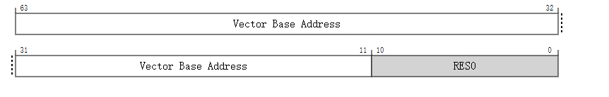

# VBAR_EL2, 向量基地址寄存器 (EL2)

保存任何需要被处理到 EL2 (Exception Level 2) 的异常的向量基地址。

## 配置

在 AArch64 架构中，系统寄存器 VBAR_EL2 的位 [31:0] 在架构上映射到了 AArch32 架构中的系统寄存器 HVBAR 的位 [31:0]。

如果 EL2 没有被实现，则此寄存器从 EL3 视角来看是保留为零（RES0）的。

如果在当前安全状态下 EL2 没有被启用，那么这个寄存器将不会产生任何效果。

## 属性

VBAR_EL2 是一个 64 位的寄存器。

## 字段描述



### Bits [63:11]

**向量基地址 (Vector Base Address)**

这是 EL2 (Exception Level 2) 异常向量的基地址。

如果实现了 `FEAT_LVA3` 特性：

- 如果 `HCR_EL2.E2H` 的有效值为 1：
  - 如果未使用标记地址，`VBAR_EL2` 的位 [63:56] 必须相同，否则使用该向量地址会导致递归异常。
- 如果 `HCR_EL2.E2H` 的有效值不为 1：
  - 如果未使用标记地址，`VBAR_EL2` 的位 [63:56] 必须为 0，否则使用该向量地址会导致递归异常。

否则：

- 如果实现了 `FEAT_LVA` 特性：

  - 如果 `HCR_EL2.E2H` 的有效值为 1：
    - 如果使用了标记地址，`VBAR_EL2` 的位 [55:52] 必须相同，否则使用该向量地址会导致递归异常。
    - 如果未使用标记地址，`VBAR_EL2` 的位 [63:52] 必须相同，否则使用该向量地址会导致递归异常。
  - 如果 `HCR_EL2.E2H` 的有效值不为 1：
    - 如果使用了标记地址，`VBAR_EL2` 的位 [55:52] 必须为 0，否则使用该向量地址会导致递归异常。
    - 如果未使用标记地址，`VBAR_EL2` 的位 [63:52] 必须为 0，否则使用该向量地址会导致递归异常。

- 如果未实现 `FEAT_LVA` 特性：

  - 如果 `HCR_EL2.E2H` 的有效值为 1：
    - 如果使用了标记地址，`VBAR_EL2` 的位 [55:48] 必须相同，否则使用该向量地址会导致递归异常。
    - 如果未使用标记地址，`VBAR_EL2` 的位 [63:48] 必须相同，否则使用该向量地址会导致递归异常。
  - 如果 `HCR_EL2.E2H` 的有效值不为 1：
    - 如果使用了标记地址，`VBAR_EL2` 的位 [55:48] 必须为 0，否则使用该向量地址会导致递归异常。
    - 如果未使用标记地址，`VBAR_EL2` 的位 [63:48] 必须为 0，否则使用该向量地址会导致递归异常。

**重置行为**

- 在温重置 (Warm reset) 时，此字段重置为架构上未知的值。


### Bit [10:0]

保留, RES0


### 访问 VBAR_EL2

当 `HCR_EL2.E2H` 的有效值为 1 时，在没有显式同步的情况下，从 EL2 使用访问器名称 `VBAR_EL2` 或 `VBAR_EL1` 进行的访问不能保证与使用另一个访问器名称的访问有序。

### 寄存器访问编码

访问此寄存器使用以下编码在系统寄存器编码空间中：


#### `MRS <Xt>, VBAR_EL2`

| op0  | op1   | CRn    | CRm    | op2   |
| :--- | ----- | ------ | ------ | ----- |
| 0b11 | 0b100 | 0b1100 | 0b0000 | 0b000 |


```
if PSTATE.EL == EL0 then
    UNDEFINED;
elsif PSTATE.EL == EL1 then
    if EffectiveHCR_EL2_NVx() IN {'xx1'} then
        AArch64.SystemAccessTrap(EL2, 0x18);
    else
        UNDEFINED;
elsif PSTATE.EL == EL2 then
    X[t, 64] = VBAR_EL2;
elsif PSTATE.EL == EL3 then
    X[t, 64] = VBAR_EL2;
                
```

#### `MSR VBAR_EL2, <Xt>`

| op0  | op1   | CRn    | CRm    | op2   |
| :--- | ----- | ------ | ------ | ----- |
| 0b11 | 0b100 | 0b1100 | 0b0000 | 0b000 |


```
if PSTATE.EL == EL0 then
    UNDEFINED;
elsif PSTATE.EL == EL1 then
    if EffectiveHCR_EL2_NVx() IN {'xx1'} then
        AArch64.SystemAccessTrap(EL2, 0x18);
    else
        UNDEFINED;
elsif PSTATE.EL == EL2 then
    VBAR_EL2 = X[t, 64];
elsif PSTATE.EL == EL3 then
    VBAR_EL2 = X[t, 64];
                
```

#### When FEAT_VHE is implemented

#### `MRS <Xt>, VBAR_EL1`

| op0  | op1   | CRn    | CRm    | op2   |
| :--- | ----- | ------ | ------ | ----- |
| 0b11 | 0b000 | 0b1100 | 0b0000 | 0b000 |


```
if PSTATE.EL == EL0 then
    UNDEFINED;
elsif PSTATE.EL == EL1 then
    if EffectiveHCR_EL2_NVx() == '011' then
        AArch64.SystemAccessTrap(EL2, 0x18);
    elsif EL2Enabled() && IsFeatureImplemented(FEAT_FGT) && (!HaveEL(EL3) || SCR_EL3.FGTEn == '1') && HFGRTR_EL2.VBAR_EL1 == '1' then
        AArch64.SystemAccessTrap(EL2, 0x18);
    elsif EffectiveHCR_EL2_NVx() IN {'111'} then
        X[t, 64] = NVMem[0x250];
    else
        X[t, 64] = VBAR_EL1;
elsif PSTATE.EL == EL2 then
    if ELIsInHost(EL2) then
        X[t, 64] = VBAR_EL2;
    else
        X[t, 64] = VBAR_EL1;
elsif PSTATE.EL == EL3 then
    X[t, 64] = VBAR_EL1;
                
```

#### When FEAT_VHE is implemented

#### `MSR VBAR_EL1, <Xt>`

| op0  | op1   | CRn    | CRm    | op2   |
| :--- | ----- | ------ | ------ | ----- |
| 0b11 | 0b000 | 0b1100 | 0b0000 | 0b000 |


```
if PSTATE.EL == EL0 then
    UNDEFINED;
elsif PSTATE.EL == EL1 then
    if EffectiveHCR_EL2_NVx() == '011' then
        AArch64.SystemAccessTrap(EL2, 0x18);
    elsif EL2Enabled() && IsFeatureImplemented(FEAT_FGT) && (!HaveEL(EL3) || SCR_EL3.FGTEn == '1') && HFGWTR_EL2.VBAR_EL1 == '1' then
        AArch64.SystemAccessTrap(EL2, 0x18);
    elsif EffectiveHCR_EL2_NVx() IN {'111'} then
        NVMem[0x250] = X[t, 64];
    else
        VBAR_EL1 = X[t, 64];
elsif PSTATE.EL == EL2 then
    if ELIsInHost(EL2) then
        VBAR_EL2 = X[t, 64];
    else
        VBAR_EL1 = X[t, 64];
elsif PSTATE.EL == EL3 then
    VBAR_EL1 = X[t, 64];
                
```
