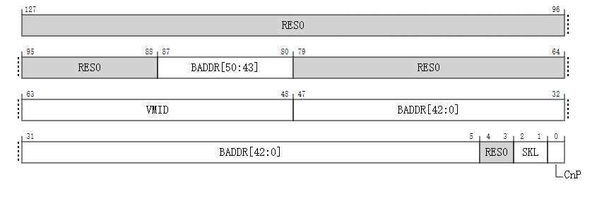
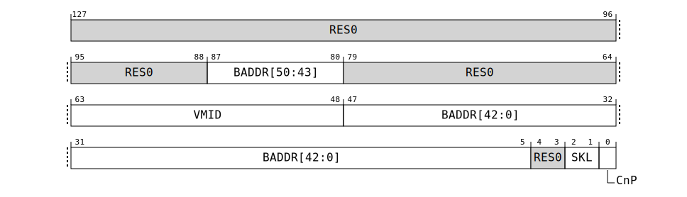

# VTTBR_EL2, 虚拟化转换表基址寄存器

保存用于 EL1 和 EL0 翻译政令中地址翻译第二阶段初始查找的转换表的基址，以及该翻译政令的其他信息。

## 配置
在 AArch64 系统寄存器 VTTBR_EL2 的位 [63:0] 在架构上映射到 AArch32 系统寄存器 VTTBR[63:0]。

如果 EL2 没有实现，则从 EL3 视角此寄存器保留为 0（RES0）。

如果在当前安全状态下没有启用 EL2，则此寄存器没有效果。

VTTBR_EL2 是一个 128 位寄存器，也可以作为 64 位值访问。如果作为 64 位寄存器访问，读取和写入位 [63:0] 并且不修改位 [127:64]。


## 属性
VTTBR_EL2 是：

- 一个 128 位寄存器，当 FEAT_D128 被实现并且 VTCR_EL2.D128 == 1；
- 一个 64 位寄存器，当 FEAT_D128 没有被实现或者 VTCR_EL2.D128 == 0；


## 字段描述
**当 FEAT_D128 被实现并且 VTCR_EL2.D128 == 1 时：**



### Bits [127:88]

保留，RES0。


### BADDR, bits [87:80, 47:5]
转换表基址：

- 阶段 2 转换表基址位 A[55:x] 存储在寄存器位 [87:80, 47:x] 中。
- 阶段 2 转换表基址位 A[(x-1):0] 为零。
- 地址位 x 是对齐转换表至表大小所需的最小地址位。x 根据 LOG2(StartTableSize) 计算得出，具体描述见 VMSAv9-128。x 的最小允许值是 5。

BADDR 字段分割如下：

- BADDR[50:43] 对应 VTTBR_EL2[87:80]。
- BADDR[42:0] 对应 VTTBR_EL2[47:5]。

**重置行为**

- 在温复位 (Warm reset) 时，该字段重置为架构上未知的值。


### Bits [79:64]
保留，RES0。


### VMID, bits [63:48]
**当 FEAT_VMID16 被实现并且 VTCR_EL2.VS == 1 时的 VMID 编码**


### VMID, bits [15:0]
转换表对应的 VMID（虚拟机标识）。

如果实现在使用 8 位的 VMID，则该字段的位 [15:8] 保留为 0（RES0）。

**重置行为**

- 在暖重置 (Warm reset) 时，该字段重置为架构上未知的值。


**当 FEAT_VMID16 没有被实现或 VTCR_EL2.VS == 0 时的 VMID 编码**


### VMID bits [15:8] 
保留，RES0。


### VMID, bits [7:0]
转换表对应的 VMID（虚拟机标识）。

当满足以下任何条件时，VMID 为 8 位：
- EL2 使用 AArch32。
- VTCR_EL2.VS 为 0。
- FEAT_VMID16 没有被实现。


**重置行为**

- 在暖重置 (Warm reset) 时，该字段重置为架构上未知的值。


### Bits [4:3]
保留，RES0。


### SKL, bits [2:1]
跳过级别。跳过级别确定从常规起始级别跳过的 Non-Secure 阶段 2 转换表查找中的级别数目。

| SKL  | 含义                        |
| ---- | --------------------------- |
| 0b00 | 从常规起始级别跳过 0 级别。 |
| 0b01 | 从常规起始级别跳过 1 级别。 |
| 0b10 | 从常规起始级别跳过 2 级别。 |
| 0b11 | 从常规起始级别跳过 3 级别。 |

**重置行为**

在暖重置 (Warm reset) 时，该字段重置为架构上未知的值。


### CnP, bit [0]
当 FEAT_TTCNP 被实现时：
公共而非私有。该位指示由 VTTBR_EL2 指向的每个条目是否属于一个公共集合，该集合可以被具有相同 VTTBR_EL2.CnP 值的内部分享域中的所有处理单元 (PE) 使用。

| CnP  | 含义                                                         |
| ---- | ------------------------------------------------------------ |
| 0b0  | 由 VTTBR_EL2 指向的转换表条目被允许与内部分享域中其他处理单元 (PE) 的 VTTBR_EL2 所指向的条目不同。这不受当前 VMID 值的影响。 |
| 0b1  | 由 VTTBR_EL2 指向的转换表条目与内部分享域中具有相同 VTTBR_EL2.CnP 值和相同当前 VMID 的所有其他处理单元 (PE) 的转换表条目相同。 |

该位允许被缓存在 TLB 中。

如果同一内部分享域中的多个处理单元 (PE) 的 VTTBR_EL2.CnP 位值为 1，并且这些 VTTBR_EL2 不指向相同的转换表条目（当使用当前 VMID 时），则使用 VTTBR_EL2 进行的转换的结果是受限不可预测的，参见“由于控制或数据值的缓存导致的受限不可预测行为”。

**重置行为**

在暖重置 (Warm reset) 时，该字段重置为架构上未知的值。

**否则：**

保留，RES0。


**当 FEAT_D128 没有被实现或 VTCR_EL2.D128 == 0 时：**



### VMID, bits[63:48]

**当 FEAT_VMID16 被实现并且 VTCR_EL2.VS == 1 时的 VMID 编码**


### VMID, bits [15:0]

转换表对应的 VMID（虚拟机标识）。

如果实现在使用 8 位的 VMID，则该字段的位 [15:8] 保留为 0（RES0）。

**重置行为**

在暖重置 (Warm reset) 时，该字段重置为架构上未知的值。


**当 FEAT_VMID16 没有被实现或 VTCR_EL2.VS == 0 时的 VMID 编码**


### Bits [15:8]

保留, RES0


### VMID, bits [7:0]

转换表对应的 VMID（虚拟机标识）。

当满足以下任何条件时，VMID 为 8 位：
- EL2 使用 AArch32。
- VTCR_EL2.VS 为 0。
- FEAT_VMID16 没有被实现。

**重置行为**

在暖重置 (Warm reset) 时，该字段重置为架构上未知的值。


### BADDR, bits [47:1]
转换表基址，A[47:x] 或 A[51:x]，位 [47:1]。

BADDR 字段代表了一个 52 位地址，如果满足以下任一条件：
- FEAT_LPA 被实现，64KB 颗粒大小正在使用，并且 VTCR_EL2.PS 的值为 0b110。
- FEAT_LPA2 被实现，4KB 或 16KB 颗粒大小正在使用，并且 VTCR_EL2.DS 的有效值为 1。
- FEAT_D128 被实现，支持 56 位物理地址 (PA)，64KB 颗粒大小正在使用，并且 VTCR_EL2.D128 的值为 0。

当 VTTBR_EL2.BADDR 代表 52 位地址时，以下规则适用：
- 寄存器位 [47:x] 包含阶段 2 转换表基址的位 [47:x]，其中 x 由起始级别的转换表大小决定。
- 最小允许的 x 值为 6。
- 寄存器位 [5:2] 包含阶段 2 转换表基址的位 [51:48]。
- 转换表基址的位 [x:0] 为零。
- 当 x > 6 时，寄存器位 [(x-1):6] 保留为 0（RES0）。
- 寄存器位 [1] 保留为 0（RES0）。
- 如果 BADDR 代表 52 位地址，并且转换表少于 8 个条目，则该表必须对齐到 64 字节。否则，转换表必须对齐到表的大小。

对于 64KB 颗粒大小，如果 FEAT_LPA 没有被实现，并且 VTCR_EL2.PS 的值为 0b110，会发生以下实施定义的行为之一：
- BADDR 使用扩展格式来表示 52 位基址。
- BADDR 不使用扩展格式。

当 ID_AA64MMFR0_EL1.PARange 的值表明实现支持 56 位 PA 大小时，阶段 2 转换表基址的位 [55:52] 为零。

如果 VTCR_EL2.PS 的有效值不是 0b110，则：
- 寄存器位 [47:x] 包含阶段 2 转换表基址的位 [47:x]。
- 寄存器位 [(x-1):1] 保留为 0（RES0）。
- 如果实现支持 52 位 PA 和 IPA，则阶段翻译使用的转换表基址的位 [51:48] 为 0b0000。

如果在使用 VTTBR_EL2 进行转换表查找时，任何定义为 RES0 的 VTTBR_EL2[47:0] 位的值为 1，则转换表基址可能不对齐，其结果是受限不可预测的，并且必须是以下情况之一：
- 转换表基址的位 [x-1:0] 被视为所有位都为零。从相应寄存器位读回的值要么是写入寄存器的值，要么为零。
- 使用该寄存器计算的转换表查找地址在非零位可能会被破坏。

AArch64 虚拟内存系统体系结构章节描述了如何根据 VTCR_EL2.T0SZ 的值、翻译阶段和转换颗粒大小来计算 x。

**重置行为**

在暖重置 (Warm reset) 时，该字段重置为架构上未知的值。


### CnP, bit [0]
当 FEAT_TTCNP 被实现时：
公共而非私有。该位指示由 VTTBR_EL2 指向的每个条目是否属于一个公共集合，该集合可以被具有相同 VTTBR_EL2.CnP 值的内部分享域中的所有处理单元 (PE) 使用。

| CnP  | 含义                                                         |
| ---- | ------------------------------------------------------------ |
| 0b0  | 由 VTTBR_EL2 指向的转换表条目被允许与内部分享域中其他处理单元 (PE) 的 VTTBR_EL2 所指向的条目不同。这不受当前 VMID 值的影响。 |
| 0b1  | 由 VTTBR_EL2 指向的转换表条目与内部分享域中具有相同 VTTBR_EL2.CnP 值和相同当前 VMID 的所有其他处理单元 (PE) 的转换表条目相同。 |

该位允许被缓存在 TLB 中。

如果同一内部分享域中的多个处理单元 (PE) 的 VTTBR_EL2.CnP 位值为 1，并且这些 VTTBR_EL2 不指向相同的转换表条目（当使用当前 VMID 时），则使用 VTTBR_EL2 进行的转换的结果是受限不可预测的，参见“由于控制或数据值的缓存导致的受限不可预测行为”。

**重置行为**

在暖重置 (Warm reset) 时，该字段重置为架构上未知的值。

**否则：**

保留，RES0。


### 访问 VTTBR_EL2

访问此寄存器使用以下编码在系统寄存器编码空间中：

#### `MRS <Xt>, VTTBR_EL2`

| op0  | op1   | CRn    | CRm    | op2   |
| :--- | ----- | ------ | ------ | ----- |
| 0b11 | 0b100 | 0b0010 | 0b0001 | 0b000 |


```
if PSTATE.EL == EL0 then
    UNDEFINED;
elsif PSTATE.EL == EL1 then
    if EffectiveHCR_EL2_NVx() IN {'1x1'} then
        X[t, 64] = NVMem[0x020];
    elsif EffectiveHCR_EL2_NVx() IN {'xx1'} then
        AArch64.SystemAccessTrap(EL2, 0x18);
    else
        UNDEFINED;
elsif PSTATE.EL == EL2 then
    X[t, 64] = VTTBR_EL2<63:0>;
elsif PSTATE.EL == EL3 then
    X[t, 64] = VTTBR_EL2<63:0>;
                
```

#### `MSR VTTBR_EL2, <Xt>`

| op0  | op1   | CRn    | CRm    | op2   |
| :--- | ----- | ------ | ------ | ----- |
| 0b11 | 0b100 | 0b0010 | 0b0001 | 0b000 |


```
if PSTATE.EL == EL0 then
    UNDEFINED;
elsif PSTATE.EL == EL1 then
    if EffectiveHCR_EL2_NVx() IN {'1x1'} then
        NVMem[0x020] = X[t, 64];
    elsif EffectiveHCR_EL2_NVx() IN {'xx1'} then
        AArch64.SystemAccessTrap(EL2, 0x18);
    else
        UNDEFINED;
elsif PSTATE.EL == EL2 then
    VTTBR_EL2<63:0> = X[t, 64];
elsif PSTATE.EL == EL3 then
    VTTBR_EL2<63:0> = X[t, 64];
                
```

#### When FEAT_D128 is implemented

#### `MRRS <Xt>, <Xt+1>, VTTBR_EL2`

| op0  | op1   | CRn    | CRm    | op2   |
| :--- | ----- | ------ | ------ | ----- |
| 0b11 | 0b100 | 0b0010 | 0b0001 | 0b000 |


```
if PSTATE.EL == EL0 then
    UNDEFINED;
elsif PSTATE.EL == EL1 then
    if EffectiveHCR_EL2_NVx() IN {'1x1'} then
        (X[t2, 64], X[t, 64]) = Split(NVMem[0x020, 128], 64);
    elsif EffectiveHCR_EL2_NVx() IN {'xx1'} then
        AArch64.SystemAccessTrap(EL2, 0x14);
    else
        UNDEFINED;
elsif PSTATE.EL == EL2 then
    if HaveEL(EL3) && EL3SDDUndefPriority() && SCR_EL3.D128En == '0' then
        UNDEFINED;
    elsif HaveEL(EL3) && SCR_EL3.D128En == '0' then
        if EL3SDDUndef() then
            UNDEFINED;
        else
            AArch64.SystemAccessTrap(EL3, 0x14);
    else
        (X[t2, 64], X[t, 64]) = Split(VTTBR_EL2, 64);
elsif PSTATE.EL == EL3 then
    (X[t2, 64], X[t, 64]) = Split(VTTBR_EL2, 64);
                
```

#### When FEAT_D128 is implemented

#### `MSRR VTTBR_EL2, <Xt>, <Xt+1>`

| op0  | op1   | CRn    | CRm    | op2   |
| :--- | ----- | ------ | ------ | ----- |
| 0b11 | 0b100 | 0b0010 | 0b0001 | 0b000 |


```
if PSTATE.EL == EL0 then
    UNDEFINED;
elsif PSTATE.EL == EL1 then
    if EffectiveHCR_EL2_NVx() IN {'1x1'} then
        NVMem[0x020, 128] = X[t2, 64]:X[t, 64];
    elsif EffectiveHCR_EL2_NVx() IN {'xx1'} then
        AArch64.SystemAccessTrap(EL2, 0x14);
    else
        UNDEFINED;
elsif PSTATE.EL == EL2 then
    if HaveEL(EL3) && EL3SDDUndefPriority() && SCR_EL3.D128En == '0' then
        UNDEFINED;
    elsif HaveEL(EL3) && SCR_EL3.D128En == '0' then
        if EL3SDDUndef() then
            UNDEFINED;
        else
            AArch64.SystemAccessTrap(EL3, 0x14);
    else
        VTTBR_EL2<127:0> = X[t2, 64]:X[t, 64];
elsif PSTATE.EL == EL3 then
    VTTBR_EL2<127:0> = X[t2, 64]:X[t, 64];
```